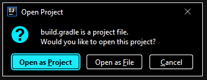
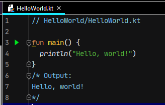
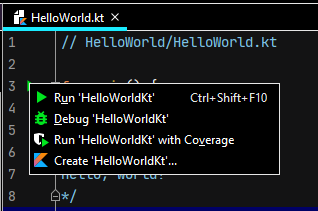

# 아토믹 코틀린 한글판 예제코드

이 책은 아토믹 코틀린 한글판 예제코드입니다. 영문 README 파일은 README.md에 있습니다.
[한글판 README](README.kor.md)에서는 소개와 인텔리J 아이디어에서 프로그램을 컴파일하고 실행하는 방법에 대해서만 설명합니다.
명령줄 컴파일이나 REPL등의 추가 정보는 [영어 README](README.md)나 인터넷에서 찾을 수 있습니다.

# 소개

이 책 예제에 접근하고 실험해볼 수 있는 가장 쉬운 방법은 이 리포지터리를 복제하거나 다운로드한 다음에 
인텔리J 아이디어에서 여는 것이다. 대부분의 사람은 이 방법으로 충분할 것이다. 
이 방법만으로 충분한 사람은 이 README의 나머지 부분을 무시해도 된다.

이 README의 나머지 부분은 인텔리J 아이디어와 명령줄을 사용해 예제를 빌드하고 테스트하는 법을 보여준다.

이 책의 연습문제와 해법을 [AtomicKotlin.com/exercises](https://www.atomickotlin.com/exercises)에서 볼 수 있다.

**노트**: 여기서 설명한 용어나 처리 과정을 명확하게 이해할 수 없다면  보통 [구글](https://www.google.com/)에서 해답을 
찾을 수 있다. 더 구체적인 문제를 해결하고 싶은 경우 [스택오버플로우(StackOverflow)](http://stackoverflow.com/)를 
활용하라. 때로 설치 방법을 [유튜브(YouTube)](https://www.youtube.com/)에서 찾을 수 있다.

# 인텔리J 아이디어에서 프로그램 컴파일하고 실행하기

가장 쉽고 빠르게 이 책 예제를 사용하는 방법은 인텔리J 아이디어에서 컴파일하고 실행하는 것이다.

1. [여기](https://www.jetbrains.com/help/idea/installation-guide.html)서 인텔리J 아이디어 설치 절차를 따라 하라.

2. [zip으로 묶은 코드 저장소](https://github.com/BruceEckel/AtomicKotlinExamples/archive/master.zip)에서 압축 파일을 다운받아 [풀라](#unpacking-a-zip-archive).

3. 인텔리J 아이디어를 시작하고 `File | Open` 메뉴를 실행하라. 압축 파일을 푼 위치로 이동해 `build.gradle.kts` 파일을 열라. 다음과 같은 대화창을 볼 수 있다.

    

    `Open as Project(프로젝트로 열기)`버튼을 선택하라.

4. 왼쪽에서 `Project(프로젝트)` 창을 볼 수 없다면 메뉴로 가서 `View | Tool Windows | Project`를 선택해 프로젝트 창을 표시하라.

5. `Examples` 폴더를 볼 수 있다. 폴더를 클릭해 열고 `HelloWorld` 폴더로 이동해 열고 `HelloWorld.kt`를 열라. 다음과 같은 내용을 불 수 있어야 한다.

    

    `fun main() {` 코드 왼쪽 가장자리의 녹색 삼각형을 클릭하라. 다음과 같은 메뉴가 표시되야 한다.

    

    맨 위의 `Run(실행)` 메뉴를 선택하면 인텔리J가 프로그램을 실행하고 결과를 출력한다.

    **노트**: (프로젝트 임포트 후) 첫번째로 프로그램을 실행하면 전체 프로젝트를 빌드하기 때문에 시간이 약간 걸릴 것이다.
    그 다음부터는 프로그램이 훨씬 더 빨리 시작된다.

# 아톰에 따른 예제 디렉터리 표

다음은 아톰 번호와 그 아톰의 예제가 들어있는 디렉터리의 이름을 표시한 색인이다.

- 아톰 03 - HelloWorld
- 아톰 04 - VarAndVal
- 아톰 05 - DataTypes
- 아톰 06 - Functions
- 아톰 07 - IfExpressions 
- 아톰 08 - StringTemplates
- 아톰 09 - NumberTypes
- 아톰 10 - Booleans
- 아톰 11 - RepetitionWithWhile
- 아톰 12 - LoopingAndRanges
- 아톰 13 - InKeyword
- 아톰 14 - ExpressionsStatements
- 아톰 15 - Summary1
- 아톰 16 - ObjectsEverywhere
- 아톰 17 - CreatingClasses
- 아톰 18 - Properties
- 아톰 19 - Constructors
- 아톰 20 - Visibility
- 아톰 21 - Packages
- 아톰 22 - Testing
- 아톰 23 - Exceptions
- 아톰 24 - Lists
- 아톰 25 - Varargs
- 아톰 26 - Sets
- 아톰 27 - Maps
- 아톰 28 - PropertyAccessors
- 아톰 29 - Summary2
- 아톰 30 - ExtensionFunctions
- 아톰 31 - NamedAndDefaultArgs
- 아톰 32 - Overloading
- 아톰 33 - WhenExpressions
- 아톰 34 - Enumerations
- 아톰 35 - DataClasses
- 아톰 36 - Destructuring
- 아톰 37 - NullableTypes
- 아톰 38 - SafeCallsAndElvis
- 아톰 39 - NonNullAssertions
- 아톰 40 - NullableExtensions
- 아톰 41 - IntroGenerics
- 아톰 42 - ExtensionProperties
- 아톰 43 - BreakAndContinue
- 아톰 44 - Lambdas
- 아톰 45 - ImportanceOfLambdas
- 아톰 46 - OperationsOnCollections
- 아톰 47 - MemberReferences
- 아톰 48 - HigherOrderFunctions
- 아톰 49 - ManipulatingLists
- 아톰 50 - BuildingMaps
- 아톰 51 - Sequences
- 아톰 52 - LocalFunctions
- 아톰 53 - FoldingLists
- 아톰 54 - Recursion
- 아톰 55 - Interfaces
- 아톰 56 - ComplexConstructors
- 아톰 57 - SecondaryConstructors
- 아톰 58 - Inheritance
- 아톰 59 - BaseClassInit
- 아톰 60 - Abstract
- 아톰 61 - Upcasting
- 아톰 62 - Polymorphism
- 아톰 63 - Composition
- 아톰 64 - InheritanceExtensions
- 아톰 65 - ClassDelegation
- 아톰 66 - DownCasting
- 아톰 67 - SealedClasses
- 아톰 68 - TypeChecking
- 아톰 69 - NestedClasses
- 아톰 70 - Objects
- 아톰 71 - InnerClasses
- 아톰 72 - CompanionObjects
- 아톰 73 - ExceptionHandling
- 아톰 74 - CheckInstructions
- 아톰 75 - NothingType
- 아톰 76 - ResourceCleanup
- 아톰 77 - Logging
- 아톰 78 - UnitTesting
- 아톰 79 - ExtensionLambdas
- 아톰 80 - ScopeFunctions
- 아톰 81 - CreatingGenerics
- 아톰 82 - OperatorOverloading
- 아톰 83 - UsingOperators
- 아톰 84 - PropertyDelegation
- 아톰 85 - DelegationTools
- 아톰 86 - LazyInitialization
- 아톰 87 - LateInitialization
- 부록 A - AtomicTest
- 부록 B - interoperability